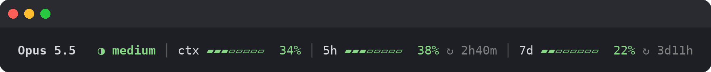
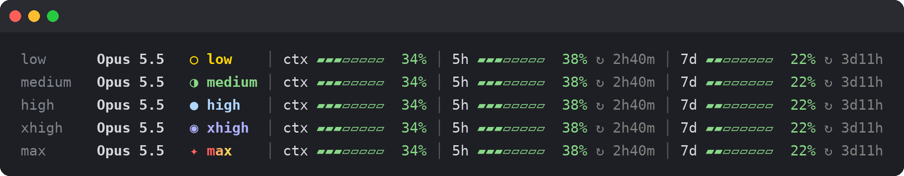
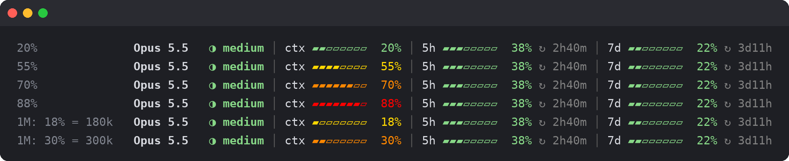
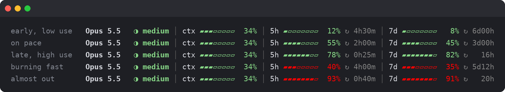
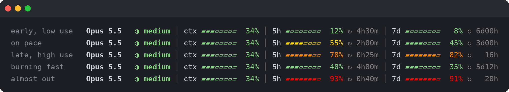
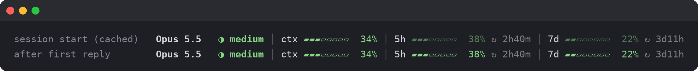

# claude-statusline

A [Claude Code status line](https://code.claude.com/docs/en/statusline) showing the model, reasoning effort, context window use and 5-hour / 7-day plan limits. Every segment has a fixed width, so nothing shifts when numbers change.



- **Effort** uses the same colors as `/effort`: low yellow, medium green, high blue, xhigh lavender, max rainbow.
- **ctx** turns yellow, orange or red as the context fills. The thresholds are in % *and* in absolute tokens; the worse of the two wins, which matters on 1M-context models.
- **5h / 7d** are colored by **pace** (your projected usage at reset if you keep the current rate) or by plain usage %. `↻` shows the time until the window resets.
- **Limits from the start:** Claude Code only reports rate limits after the first API response of a session. Until then the last known values are shown dimmed, from `~/.claude/statusline-cache`.

### Colors

**Effort**



**Context window.** The 1M rows are colored by absolute tokens even though the % is low.



**5h / 7d limits, `pace` mode (default).** Color follows the projected usage at reset: 40% used with 4h still left is red, while 78% used with 25 minutes left is green.



**Same values, `usage` mode.** Color follows the plain % used.



**Session start.** The cached limits stay dimmed until the first API response.



## Requirements

- `bash`, `jq`, `awk`, `date` (Linux or macOS)
- A terminal with 256 colors and a font that has `▰ ▱ ◑ ● ↻ │`
- Rate limits only appear for claude.ai Pro/Max subscriptions

## Install

```bash
git clone <this repo> ~/claude-statusline
cd ~/claude-statusline
./install.sh          # copies the script into ~/.claude
# or
./install.sh --link   # symlinks it, so `git pull` updates it
```

`install.sh`:
1. installs `~/.claude/statusline.sh`
2. creates `~/.claude/statusline.conf` from `statusline.conf.example`, unless one already exists
3. sets `statusLine` in `~/.claude/settings.json`, leaving your other settings alone, and saves the previous file as `settings.json.before-statusline`

### Manual install

Copy `statusline.sh` to `~/.claude/` and make it executable, copy `statusline.conf.example` to `~/.claude/statusline.conf`, then add this to `~/.claude/settings.json`:

```json
"statusLine": {
  "type": "command",
  "command": "~/.claude/statusline.sh",
  "refreshInterval": 60
}
```

## Configure

Edit `~/.claude/statusline.conf`. It is re-read on every refresh, so no restart is needed. Each threshold list is the yellow, orange and red cut-offs; anything below the first is green.

| Setting | Default | Meaning |
|---|---|---|
| `CTX_THRESHOLDS` | `50 65 80` | context % of the window |
| `CTX_TOKEN_THRESHOLDS` | `150000 250000 400000` | context in tokens |
| `LIMIT_COLOR_MODE` | `pace` | `pace` or `usage` |
| `USAGE_THRESHOLDS` | `50 75 90` | usage mode: % used |
| `PACE_THRESHOLDS` | `100 120 150` | pace mode: projected % used by reset |
| `PACE_MIN_USED` | `20` | pace mode: always green below this % used |
| `PACE_HARD_RED` | `90` | pace mode: always red at or above this % used |

Preview every state in your terminal:

```bash
~/.claude/statusline.sh --demo
```

## Uninstall

Remove `statusLine` from `~/.claude/settings.json`, then delete `~/.claude/statusline.sh`, `statusline.conf` and `statusline-cache`.
